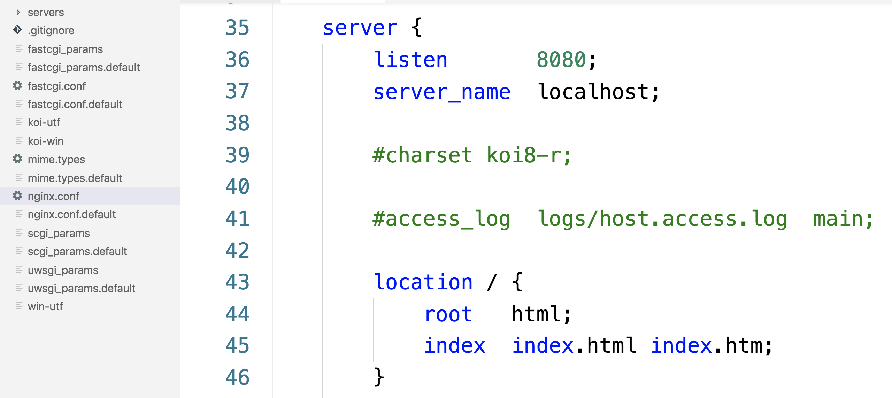

## 配置文件

不同与使用编程语言，对于nginx，我们主要是通过配置文件的方式来申明式的管理。

- 别轻视写配置文件，好的配置文件建立在对web服务器有很深的理解的基础之上的
- 可以用Git来记录我们对配置文件的修改。


#### 配置文件在哪里？

``` bash
$ nginx -V
nginx version: nginx/1.15.10
built by clang 9.0.0 (clang-900.0.39.2)
built with OpenSSL 1.0.2r  26 Feb 2019
TLS SNI support enabled
configure arguments: --prefix=/usr/local/Cellar/nginx/1.15.10 --sbin-path=/usr/local/Cellar/nginx/1.15.10/bin/nginx --with-cc-opt='-I/usr/local/opt/pcre/include -I/usr/local/opt/openssl/include' --with-ld-opt='-L/usr/local/opt/pcre/lib -L/usr/local/opt/openssl/lib' --conf-path=/usr/local/etc/nginx/nginx.conf --pid-path=/usr/local/var/run/nginx.pid --lock-path=/usr/local/var/run/nginx.lock --http-client-body-temp-path=/usr/local/var/run/nginx/client_body_temp --http-proxy-temp-path=/usr/local/var/run/nginx/proxy_temp --http-fastcgi-temp-path=/usr/local/var/run/nginx/fastcgi_temp --http-uwsgi-temp-path=/usr/local/var/run/nginx/uwsgi_temp --http-scgi-temp-path=/usr/local/var/run/nginx/scgi_temp --http-log-path=/usr/local/var/log/nginx/access.log --error-log-path=/usr/local/var/log/nginx/error.log --with-compat --with-debug --with-http_addition_module --with-http_auth_request_module --with-http_dav_module --with-http_degradation_module --with-http_flv_module --with-http_gunzip_module --with-http_gzip_static_module --with-http_mp4_module --with-http_random_index_module --with-http_realip_module --with-http_secure_link_module --with-http_slice_module --with-http_ssl_module --with-http_stub_status_module --with-http_sub_module --with-http_v2_module --with-ipv6 --with-mail --with-mail_ssl_module --with-pcre --with-pcre-jit --with-stream --with-stream_realip_module --with-stream_ssl_module --with-stream_ssl_preread_module
```

可以通过上述的命令来查询编译参数，其中`--conf-path=/usr/local/etc/nginx/nginx.conf` 就表明我们配置文件的位置。

```bash
$ cd /usr/local/etc/nginx/nginx.conf
$ tree
.
├── fastcgi.conf
├── fastcgi.conf.default
├── fastcgi_params
├── fastcgi_params.default
├── koi-utf
├── koi-win
├── mime.types
├── mime.types.default
├── nginx.conf
├── nginx.conf.default
├── scgi_params
├── scgi_params.default
├── servers
├── uwsgi_params
├── uwsgi_params.default
└── win-utf

1 directory, 15 files
```


### 配置文件写了啥？

``` bash
$ cat nginx.conf

#user  nobody;
worker_processes  1;

#error_log  logs/error.log;
#error_log  logs/error.log  notice;
#error_log  logs/error.log  info;

#pid        logs/nginx.pid;


events {
    worker_connections  1024;
}


http {
    include       mime.types;
    default_type  application/octet-stream;

    #log_format  main  '$remote_addr - $remote_user [$time_local] "$request" '
    #                  '$status $body_bytes_sent "$http_referer" '
    #                  '"$http_user_agent" "$http_x_forwarded_for"';

    #access_log  logs/access.log  main;

    sendfile        on;
    #tcp_nopush     on;

    #keepalive_timeout  0;
    keepalive_timeout  65;

    #gzip  on;

    server {
        listen       8080;
        server_name  localhost;

        #charset koi8-r;

        #access_log  logs/host.access.log  main;

        location / {
            root   html;
            index  index.html index.htm;
        }

        #error_page  404              /404.html;

        # redirect server error pages to the static page /50x.html
        #
        error_page   500 502 503 504  /50x.html;
        location = /50x.html {
            root   html;
        }

        # proxy the PHP scripts to Apache listening on 127.0.0.1:80
        #
        #location ~ \.php$ {
        #    proxy_pass   http://127.0.0.1;
        #}

        # pass the PHP scripts to FastCGI server listening on 127.0.0.1:9000
        #
        #location ~ \.php$ {
        #    root           html;
        #    fastcgi_pass   127.0.0.1:9000;
        #    fastcgi_index  index.php;
        #    fastcgi_param  SCRIPT_FILENAME  /scripts$fastcgi_script_name;
        #    include        fastcgi_params;
        #}

        # deny access to .htaccess files, if Apache's document root
        # concurs with nginx's one
        #
        #location ~ /\.ht {
        #    deny  all;
        #}
    }


    # another virtual host using mix of IP-, name-, and port-based configuration
    #
    #server {
    #    listen       8000;
    #    listen       somename:8080;
    #    server_name  somename  alias  another.alias;

    #    location / {
    #        root   html;
    #        index  index.html index.htm;
    #    }
    #}


    # HTTPS server
    #
    #server {
    #    listen       443 ssl;
    #    server_name  localhost;

    #    ssl_certificate      cert.pem;
    #    ssl_certificate_key  cert.key;

    #    ssl_session_cache    shared:SSL:1m;
    #    ssl_session_timeout  5m;

    #    ssl_ciphers  HIGH:!aNULL:!MD5;
    #    ssl_prefer_server_ciphers  on;

    #    location / {
    #        root   html;
    #        index  index.html index.htm;
    #    }
    #}
    include servers/*;
}
```


配置文件主要是通过键值对的形式，键-值中间间隔一个空格，值可以是另一组键值对。


##### worker_process

工作进程数。

##### event

```
events {
    worker_connections  1024;
}
```

每个进程允许的最大连接数，1024太小了，怎么也设置为几万。

### http

```
http {
  include       mime.types;
  server {
    # ...
  }
}
```


我们知道一台计算机上可以有多个服务器程序，nginx中就是通过http字段可以配置多个server，每个server配置一个web服务站点。

##### include


#### server



- `listen` 表明这个服务监听80端口的HTTP请求

- `server_name`：我们知道浏览器发起请求的时候，会携带一个refer的字段。如果我们想在一台服务器上

  搭建多个网站，就是靠这个属性来区分的

- `location`: 就是把对应url 的 path 映射到主机上的虚拟目录，然后/ 专门映射到 /index.html，因为用户访问一个目录的时候可能懒得加上一个文件名。


