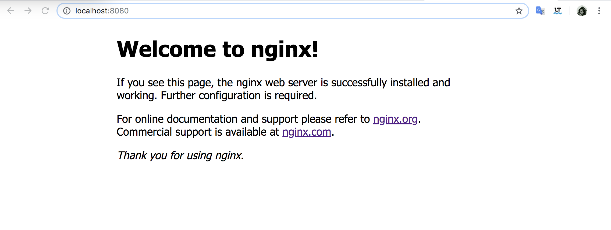

## 命令行参数

```bash
$ nginx -h   
nginx version: nginx/1.15.10
Usage: nginx [-?hvVtTq] [-s signal] [-c filename] [-p prefix] [-g directives]

Options:
  -?,-h         : this help
  -v            : show version and exit
  -V            : show version and configure options then exit
  -t            : test configuration and exit
  -T            : test configuration, dump it and exit
  -q            : suppress non-error messages during configuration testing
  -s signal     : send signal to a master process: stop, quit, reopen, reload
  -p prefix     : set prefix path (default: /usr/local/Cellar/nginx/1.15.10/)
  -c filename   : set configuration file (default: /usr/local/etc/nginx/nginx.conf)
  -g directives : set global directives out of configuration file
```


命令行直接敲

```bash
$ nginx
```

就可以启动程序。而且根据我们看到的配置，它应该监听了8080端口



#### nginx -s reload

重新加载配置文件

#### nginx -s stop 

退出


